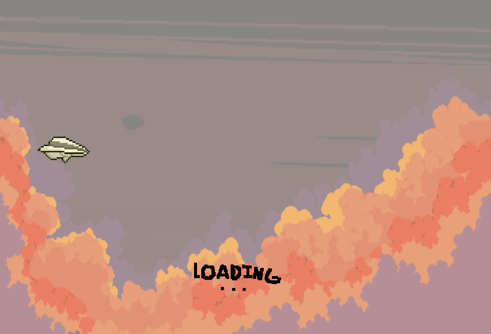
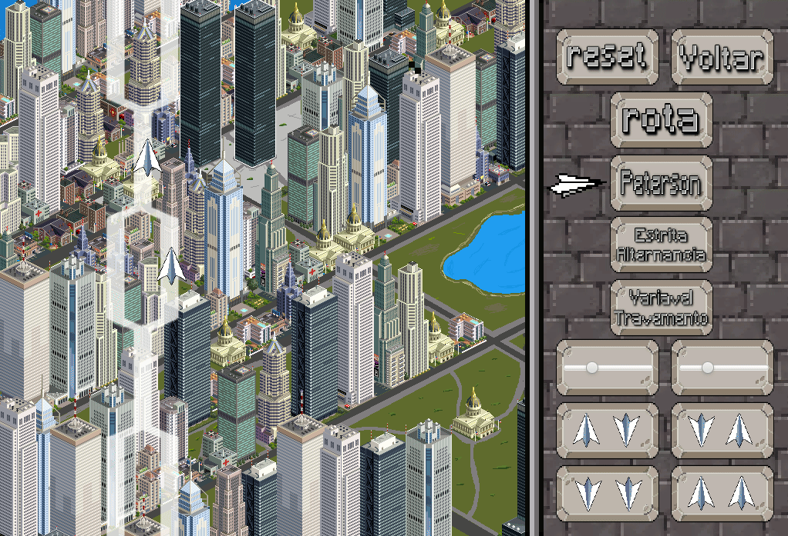

# Controle de Concorrência com Aviões de Papel

---

## 📌 Descrição do Projeto

Este projeto tem como objetivo **estudar e demonstrar técnicas clássicas de controle de concorrência**, garantindo que **duas entidades não acessem simultaneamente uma região crítica compartilhada**, evitando assim condições de corrida (*race conditions*).

---

## 🎯 Objetivo Acadêmico

Este projeto foi desenvolvido como **trabalho proposto na disciplina de Programação Concorrente** da universidade (UESB), com fins **meramente educacionais**.

O foco principal é o estudo prático de **soluções por software para exclusão mútua**, sem o uso de semáforos ou outros mecanismos de alto nível, permitindo compreender os fundamentos da sincronização entre processos/threads.

---

## 🧠 Problema Abordado

Dois agentes (aviões de papel) precisam atravessar uma **região crítica compartilhada** (o espaço aéreo comum sobre a cidade).

O sistema deve garantir que:

* Apenas **um avião** esteja na região crítica por vez
* Não ocorram **condições de corrida**
* O acesso seja controlado exclusivamente por **algoritmos de sincronização por software**

---

## 🔄 Técnicas de Concorrência Implementadas

A aplicação permite que o usuário escolha, através da interface gráfica, qual técnica será utilizada para controlar o acesso à região crítica:

### 1️⃣ Variável de Travamento (Lock Variable)

Utiliza uma variável compartilhada para indicar se a região crítica está ocupada.

* Simples de implementar
* Não garante ausência de espera ocupada
* Pode apresentar problemas em arquiteturas reais

---

### 2️⃣ Estrita Alternância

Força que os processos alternem sua entrada na região crítica.

* Garante exclusão mútua
* Pode causar **bloqueio desnecessário** mesmo quando a região crítica está livre
* Importante para compreensão conceitual

---

### 3️⃣ Solução de Peterson

Algoritmo clássico que garante exclusão mútua entre dois processos.

* Garante exclusão mútua
* Evita condições de corrida
* Combina intenção de entrada e alternância
* Muito utilizada como base teórica em sistemas operacionais

---

## 🖥️ Interface Gráfica

A interface permite:

* Selecionar dinamicamente o algoritmo de concorrência
* Visualizar o comportamento dos aviões em tempo real
* Observar como cada técnica afeta o acesso à região crítica

A visualização facilita o entendimento das vantagens e limitações de cada solução.

---

## 🛠️ Tecnologias Utilizadas

* **Java 1.8**
* **JavaFX** (UI)
* 
---

## 🧩 Estrutura do Projeto

```
controller/
model/
view/
img/
Principal.java
```

---

## ▶️ Execução



---



---

## 🚀 Como Executar o Projeto

1. Utilize **Java 1.8** (JavaFX nativo)
2. Clone o repositório
3. Abra o projeto em uma IDE compatível
4. Execute a classe:

```text
Principal.java
```

---

## 📚 Referência Teórica

As técnicas implementadas são amplamente discutidas na literatura clássica de Sistemas Operacionais e Programação Concorrente, sendo fundamentais para o entendimento de mecanismos modernos de sincronização.

---

## 👨‍💻 Autor

Projeto desenvolvido por [@MaickCross](https://github.com/MaickCross)

